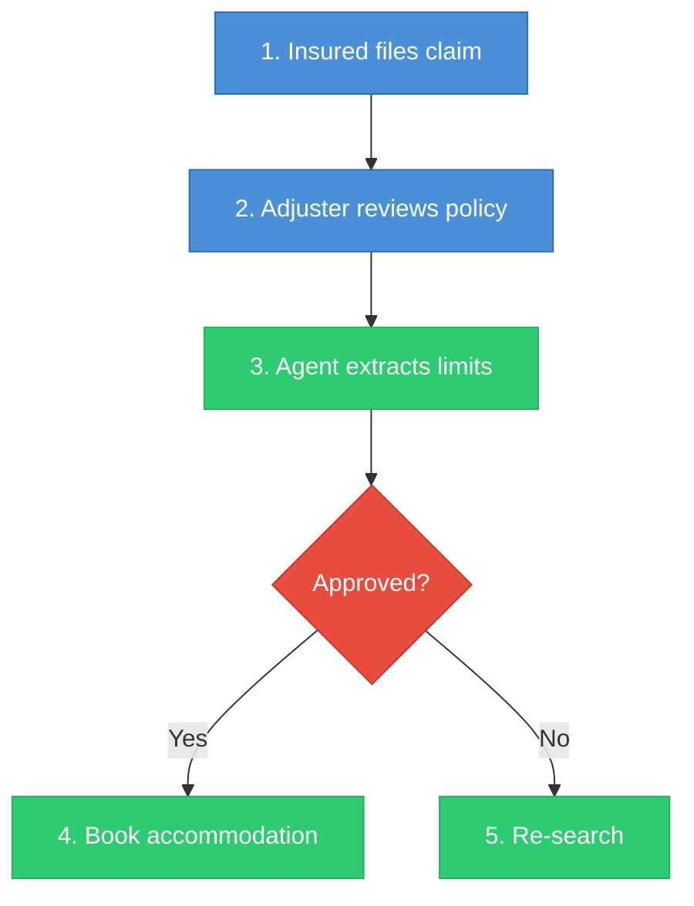
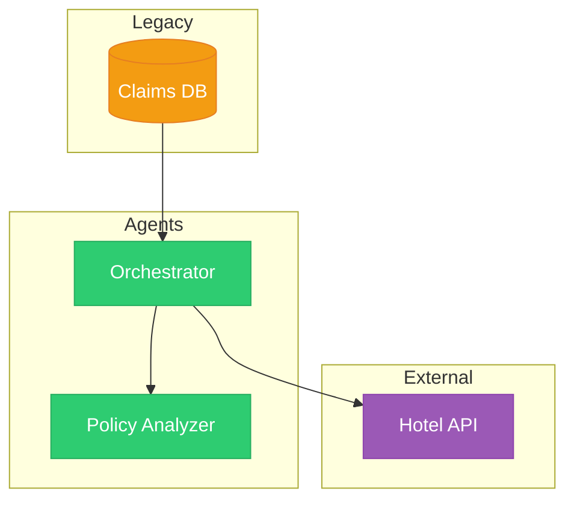
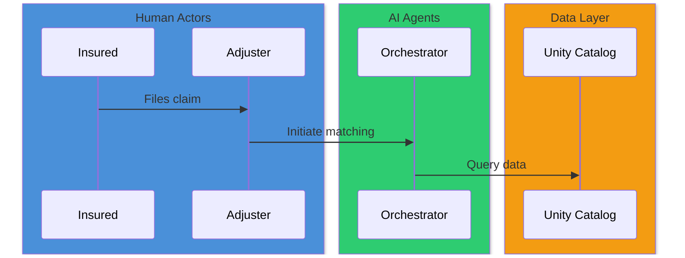

# Design Document Skill

Use this skill when creating or updating design documents in the `docs/` directory.

## Document Structure

Every design document must follow this structure:

### 1. Process Analysis
- **Problem Statement**: Clearly define the problem being solved in 2-3 sentences.
- **Key Personas**: List all personas involved in the process as a table with columns: Persona, Role, Responsibilities.
- **Current Process**: Draw the current (as-is) process using a Mermaid `flowchart TD` diagram. Number each step.
- **Process Steps Explained**: Describe each numbered step in 1-2 sentences.
- **Pain Points**: List specific inefficiencies, risks, and costs in the current process.

### 2. Proposed AI Agents Solution
- **Where AI Agents Add Value**: Map each pain point to a specific AI capability (RAG, tool calling, conversational AI, optimization).
- **Proposed Agentic Workflow**: Draw the proposed (to-be) workflow using a Mermaid `sequenceDiagram` showing agent interactions.

### 3. Solution Architecture
- **System Architecture Diagram**: Use a Mermaid `graph TD` diagram showing all components and data flows.
- **Agent Specifications**: For each agent, document: Role, Tech Stack, Input, Output, and Core Logic.
- **Data Model**: Define the key tables/schemas as Markdown tables.
- **Legacy Integration Strategy**: Describe how the solution connects to existing systems.

## Mermaid Diagram Guidelines

### General Rules
- Use `flowchart TD` for process flows (top-down).
- Use `sequenceDiagram` for agent interaction sequences.
- Use `graph TD` for architecture diagrams.
- Quote node labels that contain special characters: `id["Label with (parens)"]`.
- Keep labels concise — no more than 8-10 words per node.

### Color & Styling
All Mermaid diagrams must use color to improve readability. Apply colors consistently using the palette below.

**Color Palette:**
| Purpose | Color | Hex Code |
| :--- | :--- | :--- |
| User / Human actors | Blue | `#4A90D9` |
| AI Agents | Green | `#2ECC71` |
| Data stores / Databases | Orange | `#F39C12` |
| External systems / APIs | Purple | `#9B59B6` |
| Decision points | Red | `#E74C3C` |
| Monitoring / Observability | Gray | `#95A5A6` |

**Flowchart Styling Example:**

**Graph / Architecture Styling Example:**

**Sequence Diagram Styling:**
Mermaid sequence diagrams do not support `classDef`. Instead, use `participant` boxes and color them with `box` notation:

### When to Use Color
- **Always** color-code nodes by category (human, agent, data, external) in flowcharts and architecture diagrams.
- **Always** group participants by category using colored `box` in sequence diagrams.
- **Never** use more than 6 colors in a single diagram — keep it scannable.

## Writing Style
- Be concise but comprehensive.
- Use domain-specific terminology correctly (ALE, LKQ, Coverage D).
- Number process steps for easy reference.
- Always validate the process analysis by asking: "Does this cover the full lifecycle from trigger event to ongoing management?"
