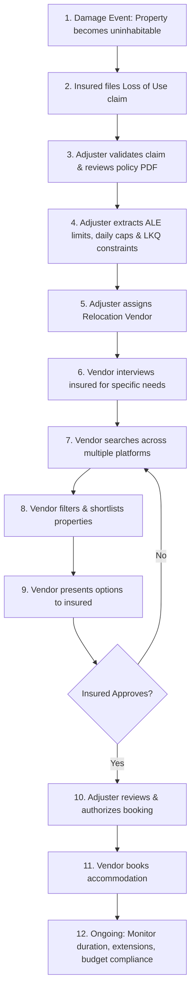
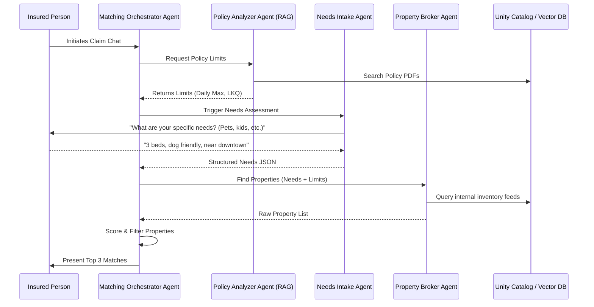

# Design Document: Databricks AI Agents for Home Insurance Accommodation Matching

## 1. Process Analysis

### The Problem Statement
When a homeowner's property is damaged (e.g., fire, flood, storm) and becomes uninhabitable, their home insurance policy typically includes "Loss of Use" (Coverage D) or "Additional Living Expenses" (ALE) coverage. This entitles the insured to temporary accommodation while their home is being repaired. The insurance company must find accommodation that satisfies three constraints simultaneously:
1. **Policy limits**: Daily rate caps, total ALE budget, and maximum duration.
2. **Like Kind and Quality (LKQ)**: The accommodation must be comparable to the insured's original home.
3. **Insured's specific needs**: Family size, pets, school districts, accessibility, commute.

### Key Personas

| Persona | Role | Responsibilities in the Process |
| :--- | :--- | :--- |
| **Insured (Policyholder)** | The homeowner whose property is damaged. | Files the claim, provides housing needs and preferences, approves or rejects proposed accommodation options. |
| **Claims Adjuster** | Insurance company employee who manages the claim. | Validates the claim, reviews the policy document to extract coverage limits and LKQ constraints, authorizes the accommodation budget, and oversees compliance. |
| **Relocation Vendor** | Third-party housing specialist contracted by the insurer. | Interviews the insured for specific needs, searches property inventories across multiple platforms, filters and presents accommodation options. |
| **Accommodation Provider** | Hotels, short-term rental platforms (Airbnb), or corporate housing companies. | Lists available properties with pricing, availability, and amenity details. |
| **Underwriter** | Insurance company employee responsible for policy terms. | Defines the original policy terms including Coverage D limits and LKQ definitions. (Upstream role, not active in the matching process but defines the constraints.) |

### The Current Accommodation Process

**Process Steps Explained:**
1. **Damage Event**: A covered peril (fire, flood, storm, etc.) renders the home uninhabitable.
2. **Claim Filing**: The insured contacts their insurer to file a "Loss of Use" or ALE claim.
3. **Claim Validation**: The claims adjuster verifies the claim is valid (covered peril, active policy).
4. **Policy Extraction**: The adjuster manually reads the policy PDF to determine Coverage D limits — total ALE budget, daily rate cap, maximum duration, and LKQ requirements.
5. **Vendor Assignment**: The adjuster engages a relocation vendor to handle the accommodation search.
6. **Needs Interview**: The vendor contacts the insured to gather specific housing needs (bedrooms, pets, school district, accessibility, commute).
7. **Property Search**: The vendor manually searches across fragmented platforms — hotels, Airbnb, corporate housing databases, local rental listings.
8. **Filtering & Shortlisting**: The vendor cross-references search results against both policy constraints and insured's needs to create a shortlist.
9. **Presentation**: The vendor presents the shortlisted options to the insured for review.
10. **Authorization**: Once the insured selects an option, the adjuster reviews it for policy compliance and authorizes the booking.
11. **Booking**: The vendor finalizes the reservation with the accommodation provider.
12. **Ongoing Management**: Throughout the stay, the adjuster monitors budget consumption, handles extension requests if repairs take longer, and ensures ongoing compliance with policy terms.

### Pain Points Identified
1. **Manual Policy Parsing**: Adjusters spend significant time reading dense, unstructured PDFs to find specific sub-limits and LKQ definitions.
2. **Slow Turnaround**: The end-to-end process from claim to booking can take days, leaving displaced families without housing.
3. **Fragmented Search**: Vendors search across disconnected platforms one by one, often missing the best options.
4. **Suboptimal Matching**: Human error in cross-referencing policy limits with property details leads to bookings that exceed budgets or fail LKQ requirements.
5. **Poor Ongoing Tracking**: Budget consumption and duration compliance are tracked manually, creating risk of overruns.
6. **High Vendor Costs**: Third-party relocation vendors charge significant fees for what is largely a manual search-and-coordinate workflow.

---

## 2. Proposed AI Agents Solution on Databricks

To automate and optimize this workflow, we propose a Multi-Agent System built natively on the Databricks Data Intelligence Platform. Databricks provides the necessary tools for secure data governance (Unity Catalog), vector storage, and agent serving (Mosaic AI Agent Framework).

### Proposed Agentic Workflow

---

## 3. Solution Architecture Design

### System Components

1. **Policy Analyzer Agent (Information Retrieval)**
   * **Role**: Parses the insured's policy document to extract strict financial limits and constraints.
   * **Tech Stack**: Databricks Vector Search, Mosaic AI Model Serving.

2. **Needs Intake Agent (Conversational)**
   * **Role**: Acts empathetically to interview the insured and extract structured requirements (number of bedrooms, pet policies, commute distances).
   * **Tech Stack**: LangChain conversational memory, Structured Output parsing.

3. **Property Broker Agent (Tool Calling)**
   * **Role**: Connects to property inventory databases to retrieve available accommodations.
   * **Tech Stack**: Mosaic AI Agent Framework, Databricks SQL (querying Unity Catalog Delta tables containing aggregated inventory feeds).

4. **Matching Orchestrator (The Coordinator)**
   * **Role**: Coordinates the workflow between the Analyzer, Intake, and Broker agents. Calculates a suitability score for each property to ensure the best matches are presented.

### Data Governance (Unity Catalog)
* **Policies**: Raw PDF documents stored in UC Volumes; parsed text chunked and stored in Delta Tables synced to Vector Search.
* **Inventory**: External property feeds ingested via Delta Live Tables (DLT) and stored as structured Delta Tables in UC.
