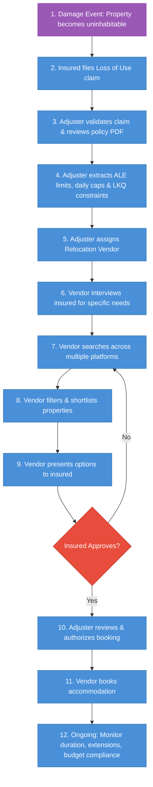
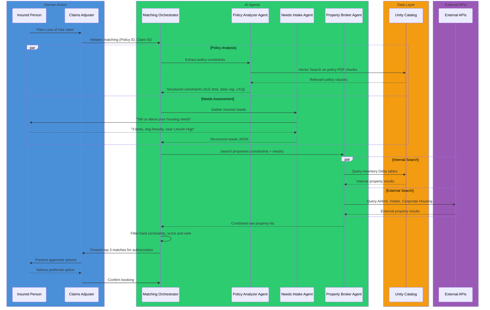
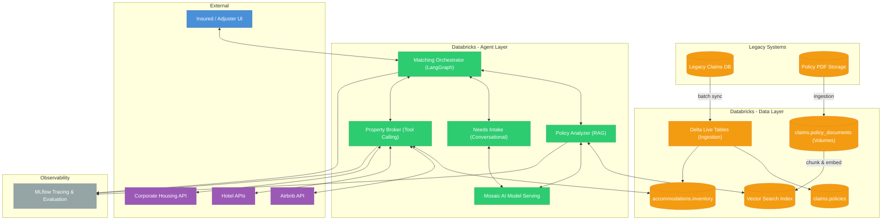

# Design Document: Databricks AI Agents for Home Insurance Accommodation Matching

## 1. Process Analysis

### The Problem Statement
When a homeowner's property is damaged (e.g., fire, flood, storm) and becomes uninhabitable, their home insurance policy typically includes "Loss of Use" (Coverage D) or "Additional Living Expenses" (ALE) coverage. This entitles the insured to temporary accommodation while their home is being repaired. The insurance company must find accommodation that satisfies three constraints simultaneously:
1. **Policy limits**: Daily rate caps, total ALE budget, and maximum duration.
2. **Like Kind and Quality (LKQ)**: The accommodation must be comparable to the insured's original home.
3. **Insured's specific needs**: Family size, pets, school districts, accessibility, commute.

### Key Personas

| Persona | Role | Responsibilities in the Process |
| :--- | :--- | :--- |
| **Insured (Policyholder)** | The homeowner whose property is damaged. | Files the claim, provides housing needs and preferences, approves or rejects proposed accommodation options. |
| **Claims Adjuster** | Insurance company employee who manages the claim. | Validates the claim, reviews the policy document to extract coverage limits and LKQ constraints, authorizes the accommodation budget, and oversees compliance. |
| **Relocation Vendor** | Third-party housing specialist contracted by the insurer. | Interviews the insured for specific needs, searches property inventories across multiple platforms, filters and presents accommodation options. |
| **Accommodation Provider** | Hotels, short-term rental platforms (Airbnb), or corporate housing companies. | Lists available properties with pricing, availability, and amenity details. |
| **Underwriter** | Insurance company employee responsible for policy terms. | Defines the original policy terms including Coverage D limits and LKQ definitions. (Upstream role, not active in the matching process but defines the constraints.) |

### The Current Accommodation Process

**Process Steps Explained:**
1. **Damage Event**: A covered peril (fire, flood, storm, etc.) renders the home uninhabitable.
2. **Claim Filing**: The insured contacts their insurer to file a "Loss of Use" or ALE claim.
3. **Claim Validation**: The claims adjuster verifies the claim is valid (covered peril, active policy).
4. **Policy Extraction**: The adjuster manually reads the policy PDF to determine Coverage D limits — total ALE budget, daily rate cap, maximum duration, and LKQ requirements.
5. **Vendor Assignment**: The adjuster engages a relocation vendor to handle the accommodation search.
6. **Needs Interview**: The vendor contacts the insured to gather specific housing needs (bedrooms, pets, school district, accessibility, commute).
7. **Property Search**: The vendor manually searches across fragmented platforms — hotels, Airbnb, corporate housing databases, local rental listings.
8. **Filtering & Shortlisting**: The vendor cross-references search results against both policy constraints and insured's needs to create a shortlist.
9. **Presentation**: The vendor presents the shortlisted options to the insured for review.
10. **Authorization**: Once the insured selects an option, the adjuster reviews it for policy compliance and authorizes the booking.
11. **Booking**: The vendor finalizes the reservation with the accommodation provider.
12. **Ongoing Management**: Throughout the stay, the adjuster monitors budget consumption, handles extension requests if repairs take longer, and ensures ongoing compliance with policy terms.

### Pain Points Identified
1. **Manual Policy Parsing**: Adjusters spend significant time reading dense, unstructured PDFs to find specific sub-limits and LKQ definitions.
2. **Slow Turnaround**: The end-to-end process from claim to booking can take days, leaving displaced families without housing.
3. **Fragmented Search**: Vendors search across disconnected platforms one by one, often missing the best options.
4. **Suboptimal Matching**: Human error in cross-referencing policy limits with property details leads to bookings that exceed budgets or fail LKQ requirements.
5. **Poor Ongoing Tracking**: Budget consumption and duration compliance are tracked manually, creating risk of overruns.
6. **High Vendor Costs**: Third-party relocation vendors charge significant fees for what is largely a manual search-and-coordinate workflow.

---

## 2. Proposed AI Agents Solution on Databricks

To automate and optimize this workflow, we propose a Multi-Agent System built natively on the Databricks Data Intelligence Platform. Databricks provides the necessary tools for secure data governance (Unity Catalog), vector storage, and agent serving (Mosaic AI Agent Framework).

### Pain Point to Agent Capability Mapping

Each pain point from Section 1 maps to a specific AI agent capability:

| Pain Point | AI Capability | Responsible Agent |
| :--- | :--- | :--- |
| Manual Policy Parsing | RAG — retrieve and extract from unstructured PDFs | Policy Analyzer Agent |
| Slow Turnaround | Parallel execution — all agents work simultaneously | Matching Orchestrator |
| Fragmented Search | Tool calling — query multiple APIs in parallel | Property Broker Agent |
| Suboptimal Matching | Scoring algorithm — deterministic rank by cost and fit | Matching Orchestrator |
| Poor Ongoing Tracking | Automated monitoring — scheduled budget/duration checks | Compliance Monitor (future) |
| High Vendor Costs | End-to-end automation — reduces vendor dependency | All Agents |

### Proposed Agentic Workflow

**Key design decisions in this workflow:**
1. **Human-in-the-loop**: The Claims Adjuster remains in the loop for authorization. The agents assist, but do not autonomously book accommodation.
2. **Parallel execution**: Policy analysis and needs intake happen concurrently (`par` block) to reduce turnaround time.
3. **Internal + External search**: The Broker queries both Unity Catalog inventory tables and external APIs in parallel.

---

## 3. Solution Architecture Design

### System Architecture

### Agent Specifications

#### 1. Policy Analyzer Agent (RAG)

| Attribute | Detail |
| :--- | :--- |
| **Role** | Retrieves relevant sections from the insured's policy PDF and extracts structured financial constraints. |
| **Pattern** | RAG (Retrieval-Augmented Generation) |
| **Databricks Components** | Unity Catalog Volumes (PDF storage), Databricks Vector Search (retrieval), Mosaic AI Model Serving (LLM) |
| **Input** | `policy_id` (string) |
| **Output** | `PolicyConstraints` — total ALE limit, daily rate cap, max duration, LKQ flag, LKQ description |
| **Core Logic** | 1. Retrieve top-k chunks from Vector Search matching "Additional Living Expenses" and "Loss of Use". 2. Prompt the LLM with retrieved context to extract structured fields. 3. Return validated `PolicyConstraints` object. |

#### 2. Needs Intake Agent (Conversational)

| Attribute | Detail |
| :--- | :--- |
| **Role** | Interviews the insured via chat to capture their specific accommodation requirements. |
| **Pattern** | Conversational with structured output |
| **Databricks Components** | Mosaic AI Model Serving (LLM with function calling) |
| **Input** | Chat history (list of messages) |
| **Output** | `UserNeeds` — bedrooms, pets, school district, accessibility, commute, special requests |
| **Core Logic** | 1. Use a system prompt to guide empathetic, structured conversation. 2. Track which required fields are still missing. 3. Once all required fields are captured, output structured JSON via function calling. |

#### 3. Property Broker Agent (Tool Calling)

| Attribute | Detail |
| :--- | :--- |
| **Role** | Searches for available accommodation from internal inventory and external providers. |
| **Pattern** | Tool-calling agent |
| **Databricks Components** | Mosaic AI Agent Framework, Unity Catalog Functions (tools), Databricks SQL |
| **Input** | `PolicyConstraints` + `UserNeeds` |
| **Output** | List of `PropertyMatch` — property ID, address, bedrooms, pet policy, daily rate, provider |
| **Tools** | `search_internal_inventory(location, beds, pet_friendly, max_daily_rate)` — UC Function querying `accommodations.inventory`. `search_external_api(provider, location, beds, pet_friendly, max_daily_rate)` — UC Function wrapping external API calls. |
| **Core Logic** | 1. Convert needs and constraints into tool call parameters. 2. Execute internal and external searches in parallel. 3. Deduplicate and return combined results. |

#### 4. Matching Orchestrator (Coordinator)

| Attribute | Detail |
| :--- | :--- |
| **Role** | Coordinates the full workflow, applies hard filters, scores properties, and presents ranked results. |
| **Pattern** | LangGraph orchestrator |
| **Databricks Components** | Mosaic AI Agent Framework, Databricks Workflows (trigger) |
| **Input** | `policy_id`, `claim_id`, chat session |
| **Output** | Top 3 ranked `PropertyMatch` results |
| **Core Logic** | 1. Dispatch Policy Analyzer and Needs Intake in parallel. 2. Pass combined constraints + needs to Property Broker. 3. **Hard filter**: Eliminate properties that violate constraints (over daily cap, insufficient bedrooms, not pet friendly when pets required). 4. **Score**: `suitability_score = (0.5 × need_match) + (0.3 × cost_efficiency) + (0.2 × lkq_match)`. 5. Return top 3 by score. |

### Data Model (Unity Catalog)

**Catalog**: `insurance_ai`

#### Schema: `claims`

**Table: `policies`**
| Column | Type | Description |
| :--- | :--- | :--- |
| `policy_id` | STRING | Primary key |
| `customer_id` | STRING | FK to customer |
| `dwelling_coverage_usd` | DOUBLE | Coverage A amount |
| `policy_document_path` | STRING | Path to PDF in UC Volumes |
| `effective_date` | DATE | Policy start date |
| `expiry_date` | DATE | Policy end date |

**Table: `extracted_policy_constraints`**
| Column | Type | Description |
| :--- | :--- | :--- |
| `policy_id` | STRING | FK to policies |
| `total_ale_limit_usd` | DOUBLE | Max ALE budget |
| `daily_limit_usd` | DOUBLE | Max daily accommodation rate |
| `lkq_required` | BOOLEAN | LKQ constraint flag |
| `lkq_description` | STRING | Free-text LKQ definition from policy |
| `max_duration_months` | INT | Max temporary housing duration |
| `extracted_at` | TIMESTAMP | When extraction was performed |

#### Schema: `accommodations`

**Table: `inventory`**
| Column | Type | Description |
| :--- | :--- | :--- |
| `property_id` | STRING | Primary key |
| `provider_name` | STRING | e.g., Airbnb, Corporate Housing |
| `address` | STRING | Full property address |
| `city` | STRING | City |
| `state` | STRING | State |
| `bedrooms` | INT | Number of bedrooms |
| `bathrooms` | INT | Number of bathrooms |
| `pet_friendly` | BOOLEAN | Accepts pets |
| `daily_rate_usd` | DOUBLE | Current daily rate |
| `available_from` | DATE | Start of availability |
| `available_to` | DATE | End of availability |
| `last_updated` | TIMESTAMP | Last inventory refresh |

**Table: `match_results`**
| Column | Type | Description |
| :--- | :--- | :--- |
| `match_id` | STRING | Primary key |
| `claim_id` | STRING | FK to claim |
| `policy_id` | STRING | FK to policy |
| `property_id` | STRING | FK to inventory |
| `suitability_score` | DOUBLE | Calculated score |
| `status` | STRING | PROPOSED / APPROVED / BOOKED / REJECTED |
| `created_at` | TIMESTAMP | When match was generated |

### Legacy Integration Strategy

| Legacy System | Integration Method | Databricks Target |
| :--- | :--- | :--- |
| Claims Database | Delta Live Tables (batch or streaming CDC) | `claims.policies` Delta table |
| Policy PDF Storage | File ingestion pipeline | `claims.policy_documents` UC Volume |
| Accommodation Provider Feeds | Scheduled API ingestion via Databricks Workflows | `accommodations.inventory` Delta table |

### Agent Evaluation Plan

Before deploying any agent to production, use **Mosaic AI Agent Evaluation** to validate quality:

| Agent | Evaluation Approach |
| :--- | :--- |
| Policy Analyzer | Compare extracted constraints against manually labeled ground truth for 50+ policies. Measure field-level accuracy. |
| Needs Intake | Validate that structured output correctly captures all stated needs from sample conversations. |
| Property Broker | Verify that returned properties match the query parameters (no constraint violations in results). |
| Matching Orchestrator | End-to-end test: given a policy + needs, verify top 3 results are valid, correctly scored, and ordered. |

All evaluation metrics are tracked in **MLflow** for reproducibility.
